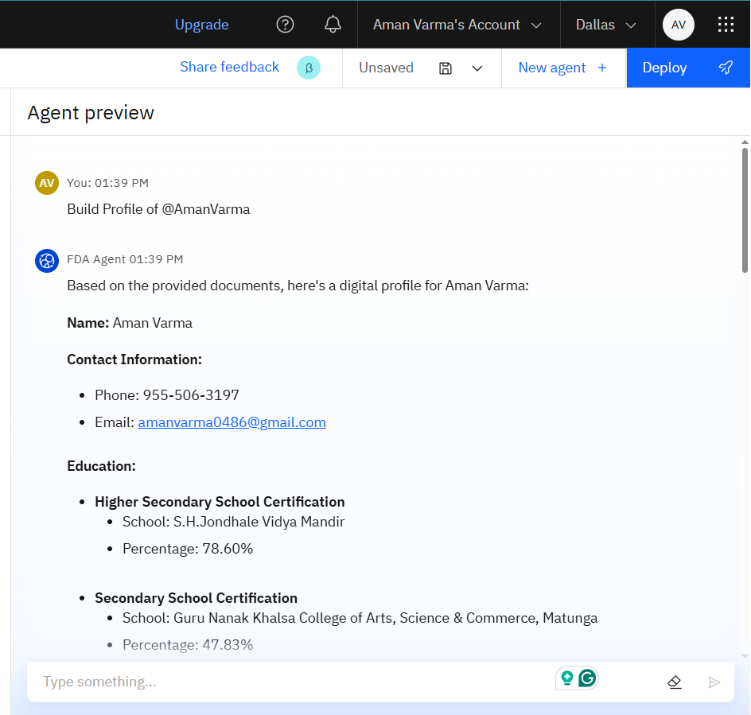
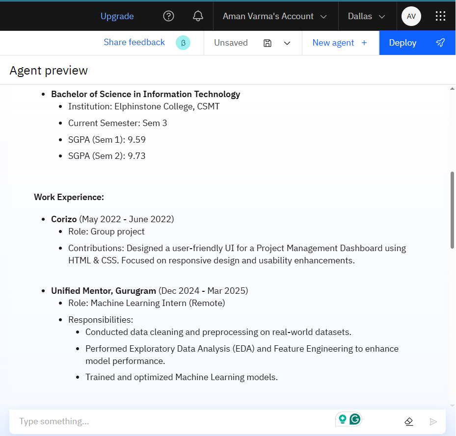
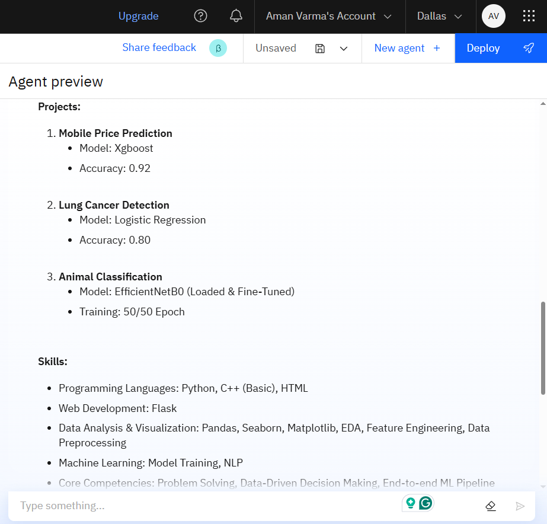
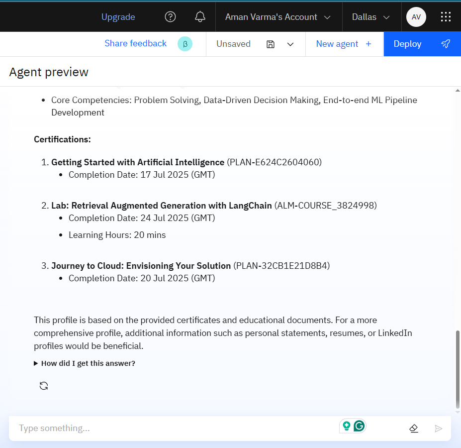

### 📄 Faculty Profile Builder Agent – IBM Watsonx  
**Smart AI-powered tool to automate faculty digital profile creation using IBM Cloud & Watsonx.**

  

  

#### 📌 About the Project
Faculty members often struggle with maintaining updated, accurate, and well-formatted academic profiles.  
This AI Agent uses **IBM Watsonx** and **Retrieval-Augmented Generation (RAG)** to automatically compile and format academic data from CVs, certificates, and research records — saving time and ensuring accuracy.

#### 🛠 Tech Stack
- 🐍 Python
- ☁ IBM Cloud
- 🤖 IBM Watsonx
- 📓 Jupyter Notebook
- 📊 RAG (Retrieval-Augmented Generation)

#### ⚙ How It Works
1. Upload your CV, research papers, and  certificates.
2. AI Agent extracts & structures key details.
3. Generates a formatted digital profile instantly.
4. Ready for accreditation, promotion, and collaborations.

## 📸 Example Output

Below are sample generated faculty profiles created by the AI Agent:

<h3 align="center">Example Output</h3>

  
  

  
  

<h3 align="center">Example Output</h3>

  <figure>
    
    <figcaption align="center"><b>Image_1</b></figcaption>
  </figure>
  <figure>
    
    <figcaption align="center"><b>Image_2</b></figcaption>
  </figure>

  <figure>
    
    <figcaption align="center"><b>Image_3</b></figcaption>
  </figure>
  <figure>
    
    <figcaption align="center"><b>Image_4</b></figcaption>
  </figure>

